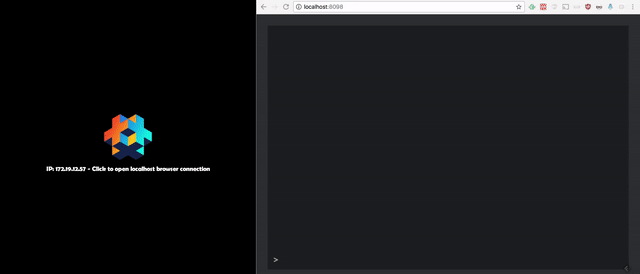

# DefCon
This is a Defold developer console. The console allows you to interact with a running game (locally or on device) through a browser.

## Installation
You can use DefCon in your own project by adding this project as a [Defold library dependency](http://www.defold.com/manuals/libraries/). Open your game.project file and in the dependencies field under project add:

	https://github.com/britzl/defcon/archive/master.zip

Or point to the ZIP file of a [specific DefCon release](https://github.com/britzl/defcon/releases).

You also need to add a dependency to [DefNet](https://github.com/britzl/defnet):

	https://github.com/britzl/defnet/archive/1.2.zip

Once you have added the dependencies to your project all you need to do is to add the `defcon/console.go` or `defcon/console.script` to a collection in your project. The next time you launch your game the console will be running and you should be able to point your browser to `localhost:8098` or `ip_of_your_device:8098` to access the console.

### Under the hood
The console is served using the web server from [DefNet](https://github.com/britzl/defnet/blob/master/defnet/http_server.lua) (a simple web server created on top of LuaSocket). The web server accepts incoming connections, reads the entire HTTP request, looks at the HTTP request line, tries to match the request to a known route and invokes the function bound to that route and finally returns a response. When a request is sent to the web root (`localhost:8098/`) the web server is configured to return a web page with the simple console that is used to send commands to the console. The console consists of a text area to show command results and a text input where commands are entered. When a command is entered it is sent to the http server (`localhost:8098/console`) using a XMLHttpRequest object.

## Commands
The console comes with a few basic commands:

* `inspect [name]` - Inspect a table with the given name and pretty print it's contents. The command will search the global scope, loaded modules and added modules.
* `commands` - Show all commands
* `modules` - Show all added modules (read more about this below)
* `toggle_profiler` - Toggle the on-screen profiler
* `toggle_physics_debug` - Toggle physics debug
* `start_record [name]` - Start recording video to a file with the given name
* `stop_record` - Stop recording video

### Running arbitrary Lua code
If the command given to the console doesn't match any known command the entered string will be run as arbitrary Lua code instead.

### Extend
You can extend the console with commands of your own. This is the true power of the console since it can speed up testing and help with debugging.

#### Commands from module functions
You can add whole modules and have all functions mapped as commands:

	local foobar_module = require"(foobar_module")
	local console = require("defcon.console")
	console.add_module(foobar_module)

#### Custom commands
You can also add custom commands:

	local console = require("defcon.console")
	console.add_command("mycommand", function(foo, bar)
		-- execute command here
		return "Return this back to console"
	end)

## Download files
The web server also allows you to download files available to your game. If you make an HTTP GET or open your browser to the following URL the specified file will be returned:

	localhost:8098/download/path/to/myfile
	
## Credits
* URL encode/decode from [CGILua](https://github.com/keplerproject/cgilua/blob/master/src/cgilua/urlcode.lua)
* String split from [Lua wiki](http://lua-users.org/wiki/SplitJoin)